  

  
  
  
  

 

## About

I'm a backend-leaning software developer based in **Gurugram, India**. I've interned as a software engineer at **INDmoney** and **Tally Solutions**, and founded **Zhecker Technologies**. Most of my work lives in **Go** — services that talk to **PostgreSQL**, stream through **Kafka** and **RabbitMQ**, ship in containers, and run on **AWS** and **Azure**.

<table>
  <tr>
    <td width="33%" valign="top">
       
      <b>Build</b> 
      APIs and services in Go and Gin, designed to be boring in production.
    </td>
    <td width="33%" valign="top">
       
      <b>Contribute</b> 
      Open source contributor — I like reading unfamiliar codebases and leaving them better.
    </td>
    <td width="33%" valign="top">
       
      <b>Ship</b> 
      Founder mindset: take an idea from a blank repo to something people actually use.
    </td>
  </tr>
</table>

## Experience

| Role | Company |
| :-- | :-- |
| Software Engineer Intern | **INDmoney** |
| Software Engineer Intern | **Tally Solutions** |
| Founder | **Zhecker Technologies** |

## Tech stack

  

## GitHub activity

  
  

  

<!-- Contribution calendar, regenerated daily by .github/workflows/snake.yml into the `output` branch -->

  <picture>
    <source media="(prefers-color-scheme: dark)" srcset="https://raw.githubusercontent.com/salvatoreOm/salvatoreOm/output/github-snake-dark.svg" />
    <source media="(prefers-color-scheme: light)" srcset="https://raw.githubusercontent.com/salvatoreOm/salvatoreOm/output/github-snake.svg" />
    
  </picture>

 

  Open to collaborating on interesting projects — <a href="mailto:omparihar0001@gmail.com">say hi</a>.

